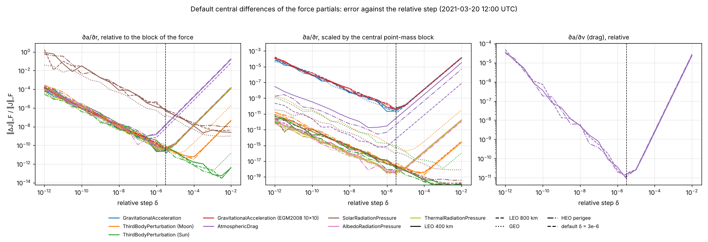

# Covariance Propagation Provenance

This page traces every equation implemented for the state transition matrix and covariance work (phase 2,
feature 1), including the frame-change velocities that the covariance work relies on. For each one it gives the quantity, where it is implemented, the published reference it comes from,
the tests that check it, and the status of the citation:

- **Verified on the text**: the cited passage was read and matches the implementation.
- **To be verified by S. Guillet**: the reference could not be read from the development environment. The
  implementation is checked by the listed tests, and the citation awaits confirmation on the text.
- **Confirmed by S. Guillet**: a citation of the previous kind that S. Guillet has confirmed, with the date.

Rows are added by each pull request that implements an equation. A formula of the new code that is missing from
this page is a defect.

## Equations

| Quantity | Implementation | Reference | Tests | Citation status |
|----------|----------------|-----------|-------|-----------------|
| Angular velocity of a frame transform: ICRF relative to the frame, in the frame axes, so that `R(t + dt) = R(t) exp(-[ω×] dt)` | Native `TransformFrameProxy` (SPICE `sxform_c`, then `xf2rav_c`), composed by `Frames/Frame.cs`, `Frame.ToFrame` | NAIF, `xf2rav_c` documentation: angular velocity of the second frame relative to the first, expressed in the first. | `FrameChainIntegrationTests.SpiceFrameRotationFollowsItsAngularVelocity` (ITRF93, IAU_MOON, MOON_ME, DSS-13_TOPO; below 2e-13 rad over 1 s) | Convention measured on the SPICE frames by the listed test. NAIF text: confirmed by S. Guillet (2026-10-07). |
| Velocity of a frame change, `r' = R r`, `v' = R v - (R ω) × r'` | `OrbitalParameters/OrbitalParameters.cs`, `OrbitalParameters.ToFrame` | Transport theorem, with `ω` of `Frame.ToFrame` brought into the target frame by `R`. Same map as the SPICE state transformation matrix `[[R, 0], [dR/dt, R]]` (NAIF, `sxform_c` documentation), with `dR/dt = -[(R ω)×] R`. | `StateVectorFrameVelocityTests` (geocentric Moon against SPICE in ITRF93, both directions, 2000 and 2021; DSS-13 against SPICE; 1e-12), `FrameTests.StateInSiteFrameMatchesSpiceTopocentricFrame` | Checked against SPICE states (a few 1e-16). NAIF text: confirmed by S. Guillet (2026-10-07). |
| Angular velocity of TIRS, `(0, 0, -Ω)` in TIRS axes, `Ω = 2π × 1.00273781191135448 / 86400` rad/s | `Frames/TirsFrame.cs`, `TirsFrame.EarthRotationRate` | IAU SOFA, `iauPvtob`, release 2023-10-11: constant `OM` and velocity `Ω ẑ × r` of an Earth-fixed point in the CIRS. The precession-nutation rate of the CIP is left out, as in `iauPvtob`. | `TirsFrameTests.TirsAngularVelocityDirectionIsNearZAxis`, `TirsFrameTests.TirsAngularVelocityMatchesFreshRecomputationOverOneSecond`, `FrameChainIntegrationTests.TirsAngularVelocityMatchesItrf93` (5e-11 rad/s), `FrameChainIntegrationTests.PointFixedInTirsMovesAtTheDerivativeOfItsIcrfPosition` (1e-6) | Verified on the text (`external-lib/sofa-src/pvtob.c`). |
| Angular velocity of CIRS, `-2 q⁻¹ dq/dt` for `q` the CIRS to ICRF rotation, by central difference over ±100 s (rounding and truncation both near 1e-7 of the rate) | `Frames/CirsFrame.cs`, `CirsFrame.ComputeAngularVelocity` | Quaternion kinematics in the Hamilton convention, `dq/dt = ½ q ⊗ ω_B` for the angular velocity `ω_B` of the rotating frame in its own axes: J. Solà, *Quaternion kinematics for the error-state Kalman filter*, arXiv:1711.02508, 2017. The sign gives the angular velocity of ICRF relative to CIRS, the convention of the first row. | `CirsFrameTests.CirsAngularVelocityMatchesFreshRecomputationOverOneSecond` (1e-12 rad), `FrameChainIntegrationTests.PointFixedInCirsMovesAtTheDerivativeOfItsIcrfPosition` (1e-5) | Checked by the listed tests. Solà (2017): confirmed by S. Guillet (2026-10-07). |
| Angular velocity of a site frame, the body-fixed one rotated into topocentric axes | `Surface/SiteFrame.cs`, `SiteFrame.GetStateOrientationToICRF` | A frame fixed in the body frame shares its angular velocity; topocentric axes north, west, zenith, as the SPICE topocentric frames (`earth_topo_201023.tf`). | `FrameTests.SiteFrameMatchesSpiceTopocentricFrame` (1e-16 rad/s against DSS-13_TOPO), `FrameTests.SiteFrameDoesNotRotateRelativeToItrf93` | Checked against the SPICE frame DSS-13_TOPO. |
| Jacobian of a frame change of a state, `J = [[R, 0], [-[(R ω)×] R, R]]` | `Math/Matrix.cs`, `Matrix.CreateStateTransformationJacobian`; used by `OrbitalParameters.ToFrame` | Exact derivative of the velocity row above, a map linear in `(r, v)` at a fixed epoch. Same block structure as the SPICE state transformation matrix (NAIF, `sxform_c` documentation) and as the ECI to ECEF covariance transformation of D. A. Vallado, *Covariance Transformations for Satellite Flight Dynamics Operations*, AAS 03-526, 2003. | `StateVectorFrameCovarianceTests.ToFrame_RotatingFrame_JacobianMatchesFiniteDifferences`, `MatrixTests.CreateStateTransformationJacobian_*` | Derivation checked by central differences (1e-9). SPICE `sxform_c`, Vallado (2003): confirmed by S. Guillet (2026-10-07). |
| Covariance through a linear map, `P' = J P Jᵀ`, then `(P' + P'ᵀ) / 2` | `Math/Matrix.cs`, `Matrix.TransformCovarianceWithJacobian`, `Matrix.Symmetrize` | Covariance of a linear transformation of a random vector, `Cov(J x) = J Cov(x) Jᵀ`: B. D. Tapley, B. E. Schutz, G. H. Born, *Statistical Orbit Determination*, Elsevier, 2004, chapter 4; Vallado (2003), op. cit. The symmetrization follows the rule of the feature specification (C2): every published covariance is symmetrized. | `StateVectorFrameCovarianceTests.ToFrame_RotatingFrame_CovarianceIsTransformedWithTheFiniteDifferenceJacobian`, `..._RoundTripThroughRotatingFrame_RestoresStateAndCovariance`, `..._CovarianceIsSymmetricPositiveSemiDefinite`, `MatrixTests.TransformCovarianceWithJacobian_*`, `MatrixTests.Symmetrize_*` | Confirmed by S. Guillet (2026-10-07). |
| Covariance in RTN, pure rotation `diag(R, R)` (unchanged, now documented) | `OrbitalParameters/StateVector.cs`, `StateVector.RotateCovarianceToRtn`, `StateVector.RotateCovarianceFromRtn` | Convention of the RTN covariance at TCA in the CCSDS Conjunction Data Message (CCSDS 508.0-B-1), used by the conjunction analysis and the CDM export. The rotation rate of the RTN frame is not applied. | `StateVectorTests.RotateCovarianceToRtn_DiagonalCovariance`, `ConjunctionAssessmentTests` | Confirmed by S. Guillet (2026-10-07). |
| Default state partials of a force (B1): central differences of the acceleration at the fixed epoch of the state, column `j` = `(a(x + h e_j) - a(x - h e_j)) / ((x_j + h) - (x_j - h))`, with `h_r = δ_r max(|r|, 1 m)`, `h_v = δ_v max(|v|, 1 m/s)`, `δ_r = δ_v = 3e-6`; the velocity columns are skipped for a force that does not depend on the velocity | `Propagator/Forces/ForceBase.cs`, `ForceBase.AccumulateStatePartials` (default of every force without analytic partials, including forces written outside the library) | Central difference, and division by the difference of the perturbed components as stored to remove the representation error of the step: W. H. Press, S. A. Teukolsky, W. T. Vetterling, B. P. Flannery, *Numerical Recipes*, 3rd edition, Cambridge University Press, 2007, section 5.7. Steps from the [step study](#finite-difference-steps) below. | `ForceBasePartialsTests` (force of known Jacobian, non-linear in `r` and linear in `v`, at the four reference states: below 1e-8), `FiniteDifferenceStepStudyTests` | Steps measured by the study. *Numerical Recipes*: confirmed by S. Guillet (2026-10-07). |
| Default parameter partials: central difference on the drag coefficient `Cd` or the reflectivity coefficient `Cr` of the evaluation context, `h_p = 1e-3 max(|C|, 1)`; `Cr` is shared by SRP, albedo and thermal pressure, so `∂a/∂Cr` sums their three contributions | `Propagator/Forces/ForceBase.cs`, `ForceBase.AccumulateParameterPartials`; `ForceEvaluationContext` | The built-in forces are linear in their coefficient, so the central difference has no truncation error, and its rounding error is about `ε / δ_p`. | `ForceParameterPartialsTests` (`∂a/∂Cd = a / Cd` for drag, `∂a/∂Cr = a / Cr` for SRP, albedo and thermal, and their sum: below 1e-10), `ForceEvaluationContextTests` (the acceleration scales exactly with the mass and the coefficient) | Linearity checked bit for bit by the listed tests. |
| Point-mass partials of the central body (B2), `∂a/∂r = μ (3 r rᵀ / |r|⁵ - I / |r|³)`, with `μ` and `r` relative to the attracting body, as in the acceleration | `Body/PointMassPartials.cs`, `GravitationalField.TryAccumulatePositionPartials`, `CelestialItem.TryAccumulateGravitationalPositionPartials`, `GravitationalAcceleration` | O. Montenbruck, E. Gill, *Satellite Orbits: Models, Methods and Applications*, Springer, 2000, chapter 7 (variational equations). | `GravitationalAccelerationPartialsTests` against Ridders' reference: geocentric states 1e-13 to 2e-12; states relative to the Sun, with and without the ephemeris cache, 2e-10 to 1e-8 (limited by the resolution of heliocentric positions); tolerance 1e-6 | Confirmed by S. Guillet (2026-10-07). |
| Geopotential partials: none analytic until the Cunningham recursion (step 5a); the default central differences | `GeopotentialGravitationalField.TryAccumulatePositionPartials` returns false, and `GravitationalAcceleration` falls back to the default path | See the first row. | `GravitationalAccelerationPartialsTests.Geopotential_*`; step study, EGM2008 10×10: below 5e-11 at the default step | Not applicable. |
| Third-body partials (B4), `∂a/∂r = μ_j (3 ρ ρᵀ / |ρ|⁵ - I / |ρ|³)`, `ρ = r - d_j`; the indirect term does not depend on `r` | `Propagator/Forces/ThirdBodyPerturbation.cs`, `ThirdBodyPerturbation`; `d_j` comes from the same method as the acceleration (ephemeris cache, or SPICE), in the frame of the state | Montenbruck and Gill (2000), op. cit., chapter 7. | `ThirdBodyPerturbationPartialsTests`: four reference states, Moon and Sun, with and without the ephemeris cache, against Ridders' reference: 1e-13 to 2e-12; tolerance 1e-6 | Confirmed by S. Guillet (2026-10-07). |
| Reference derivative of the tests: Ridders' extrapolation of central differences over a decreasing sequence of steps (contraction 1.4, table of 10, stop when the error grows by a factor of 2), with its error estimate | Test project, `RiddersDerivative` | C. J. F. Ridders, "Accurate computation of F'(x) and F'(x)F''(x)", *Advances in Engineering Software* 4(2), 75-76, 1982; *Numerical Recipes*, op. cit., section 5.7, routine `dfridr`. | `RiddersDerivativeTests` (sine, exponential, inverse square: 1e-12 to 1e-13) | Confirmed by S. Guillet (2026-10-07). |
| Variational equations (A1): `dΦ/dt = A Φ`, `Φ(t0) = I`, and `dΨ/dt = A Ψ + B ∂a/∂p`, `Ψ(t0) = 0`, with `A = [[0, I], [G, D]]`, `G = ∂a/∂r`, `D = ∂a/∂v` (summed over the forces), `B = [0 ; I]`, `p` = Cd then Cr | `Propagator/Variational/VariationalEquations.cs`, `VariationalEquations.Step` | Montenbruck and Gill (2000), op. cit., section 7.2. | `VariationalEquationsTests`: harmonic and damped oscillators (Φ) and forced oscillator (Ψ_Cd, Ψ_Cr) against their closed forms, 6e-15 to 7e-14, tolerance 1e-12; `VariationalPropagationTests.TwoBody_PhiMatchesCentralDifferencesOfWholePropagations` (9e-9, tolerance 1e-7); `VariationalSupportTests.Heliocentric_PhiMatchesCentralDifferencesOfWholePropagations` (6.6e-9, tolerance 1e-6) | To be verified by S. Guillet (section number). |
| Process-noise covariance (A1): `dQ/dt = A Q + Q Aᵀ + B Qc Bᵀ`, `Q(t0) = 0`, for a white acceleration noise of spectral density `Qc` (m²/s³); `Q` stored as its 21 upper elements, with the derivative `M + Mᵀ + B Qc Bᵀ`, `M = A Q`, symmetric by construction | `VariationalEquations.Step`; `IProcessNoiseModel`, `ConstantProcessNoise` (constant `Qc` in the propagation frame, until the RTN model of C3) | A. Gelb (editor), *Applied Optimal Estimation*, MIT Press, 1974, chapter 4; Tapley, Schutz and Born (2004), op. cit., section 4.9. | `VariationalEquationsTests`: free particle, `Q = [[Qc t³/3, Qc t²/2], [Qc t²/2, Qc t]]` from `∫ Φ(τ) B Qc Bᵀ Φ(τ)ᵀ dτ` (2e-14, tolerance 1e-13); harmonic oscillator, closed form (1.5e-14, tolerance 1e-12); positive semi-definite over a LEO orbit | To be verified by S. Guillet. |
| Discretization (A1): over a step of size `h`, `Y_s = Y_0 + h Σ_{j<s} a_sj K_j`, `K_s = A(x_s) Y_s + [0 | B ∂a/∂p(x_s)]`, `Y_1 = Y_0 + h Σ b_j K_j`, from the 13 stage states `x_s` of the state step; `Q` with the same stages | `VariationalEquations.Step` on `RK78Stepper.StageStates` (coefficients of `RK78ButcherTableau`) | Derivation: differentiating the stage equations of the state, `x_s = x_0 + h Σ a_sj f(x_j)`, with respect to `x_0` and `p` at fixed `h` gives exactly this recurrence, so `Y_1` is the Jacobian of the discrete step map, up to the accuracy of the partials. The state stages do not depend on `Y`. | `VariationalEquationsTests.LinearSystem_EachColumnOfY_IsTheStepOfTheUnitState` (bit for bit); `VariationalEquationsTests.OneStep_YIsTheJacobianOfTheStepMap`, against Ridders' derivative of the step map at the four reference states (3e-12 to 3e-11, tolerance 1e-8, Ridders' estimate below 1e-10) | Derivation checked by the listed tests. |
| Step-size control (A2): on the state only by default; with `IncludeInStepControl`, the embedded error of `Y`, each column scaled by the initial perturbation it stands for (`|r0|`, `|v0|`, or `|p|`, 1 when `p = 0`), joins the component norm of the state | `RK78Integrator`, `VariationalEquations.ScaledError`, `RK78Integrator.ScaledComponentError` | Hipparchus, `AdaptiveStepsizeIntegrator` (Javadoc: only the primary part of the state controls the step) and `DormandPrince853Integrator.estimateError` (loop over the main set only), read in the source of the `master` branch on 2026-10-07. Component norm: E. Hairer, S. P. Nørsett, G. Wanner, *Solving Ordinary Differential Equations I*, Springer, section II.4, equation (4.11). | `PropagationGoldenTests.Rk78PropagationWithTheVariationalEquations_IsBitIdenticalToGolden`; `VariationalPropagationTests.WithTheVariationalEquations_TheTrajectoryIsBitIdentical`; `VariationalEquationsTests.ScaledError_IsTheStateErrorOfTheScaledUnitStates`; `VariationalPropagationTests.IncludeInStepControl_AddsTheErrorOfYToTheAdaptiveControlOnly` | Hipparchus: verified on the source. Hairer, Nørsett and Wanner: to be verified by S. Guillet. |
| Values at any epoch (A3): a shortened step of size `t - t_k` from the start of the step that contains `t`, in the context (mass, Cd, Cr) of the segment | `Propagator/Variational/PropagationDynamics.cs`, `PropagationDynamics.Evaluate`, `PropagationDynamics.ShortenedStep`; `PropagationSolution.EvaluateVariational` | The discretization of the row above, with `h = t - t_k`. | `VariationalPropagationTests.AFullShortenedStep_ReproducesTheStoredValuesAndState_BitForBit`; `VariationalPropagationTests.InsideAStep_MatchesAPropagationThatStopsThere` (identical) | Not applicable. |
| Chaining across segments (A5): `Φ(t, t0) = Φ(t, te) Φ(te, t0)`, `Ψ(t, t0) = Φ(t, te) Ψ(te, t0) + Ψ(t, te)`, `Q(t, t0) = Φ(t, te) Q(te, t0) Φ(t, te)ᵀ + Q(t, te)`; at an impulsive maneuver, open loop, the values at `te` from a shortened step become the entry values of the next segment | `VariationalEquations.Compose`; `PropagatorBase.Propagate` | Derivation: the variational equations are linear, so their solution from `t0` is the solution from `te` applied to the values at `te`; the noise after `te` is independent of the state at `te`. An impulse fixed in epoch and in ΔV gives `∂x⁺/∂x⁻ = I`. | `VariationalPropagationTests.Composition_MatchesAnIndependentPropagationFromAnIntermediateEpoch` (Φ 2e-14, `Q` 2e-11, tolerance 1e-10); `VariationalPropagationTests.AtAManeuver_PhiIsContinuous_AndTheBurnIsRecorded` | Derivation checked by the listed tests. |
| Reference of the tests, Keplerian STM: the closed-form two-body solution `r = f r0 + g v0`, `v = ḟ r0 + ġ v0`, with the Lagrange coefficients in universal variables and the Stumpff functions `c2`, `c3`; `Φ` is its gradient, by forward-mode automatic differentiation, and the root of the universal Kepler equation carries its derivative through one Newton step in dual arithmetic (implicit function theorem) | Test project, `KeplerianStm`, `Dual` | Universal variables: W. H. Goodyear, "Completely general closed-form solution for coordinates and partial derivatives of the two-body problem", *Astronomical Journal* 70, 189, 1965; D. A. Vallado, *Fundamentals of Astrodynamics and Applications*, 4th edition, Microcosm Press, 2013, algorithm 8; R. R. Bate, D. D. Mueller, J. E. White, *Fundamentals of Astrodynamics*, Dover, 1971, sections 4.4 and 4.5. Compared, without copying code, with hapsira 0.18.0 (MIT license), `core/propagation/vallado.py` and `_math/special.py`. Automatic differentiation: A. Griewank, A. Walther, *Evaluating Derivatives*, 2nd edition, SIAM, 2008, chapter 3. | `KeplerianStmTests`: state against the two-body propagation of the library through the Keplerian elements, 60 s to 1 day (2.2e-14 at most, tolerance 1e-12); Φ against central differences of the closed form (6.6e-10 to 7.4e-9, tolerance 1e-7), including a circular orbit; composition (2.3e-13, tolerance 1e-11); symplectic defect relative to `‖Φ‖²` (3.7e-16 at most, tolerance 1e-14) and determinant (1.3e-12 at most, tolerance 1e-11) | hapsira: compared on the source (2026-10-08). Goodyear, Vallado, Bate, Mueller and White, Griewank and Walther: to be verified by S. Guillet. |
| Structural properties (F2): the flow of a Hamiltonian system is symplectic, `ΦᵀJΦ = J`, `J = [[0, I], [-I, 0]]`, with `det Φ = 1`; the two-body, geopotential and third-body accelerations derive from a potential | Test project, `StructuralPropertiesTests`, `StmMeasures` | V. I. Arnold, *Mathematical Methods of Classical Mechanics*, 2nd edition, Springer, 1989, section 16 (Liouville's theorem) and chapter 8 (Hamiltonian phase flows preserve the symplectic structure). Departure of the integrated `Φ`, derived: `d(ΦᵀJΦ)/dt = Φᵀ (AᵀJ + JA) Φ` with `AᵀJ + JA = [[G - Gᵀ, D], [-Dᵀ, 0]]`, so for a conservative force (`D = 0`) only the asymmetry of `G` and the RK step map, which is not symplectic, move it. Canonical units, derived: with `S = diag(I / L, (T / L) I)`, `S J S = (T / L²) J`, so the property holds for `S Φ S⁻¹`. | See the [structural properties](#structural-properties-f2) below | Arnold: to be verified by S. Guillet. Derivations checked by the measurements below. |

## Finite-Difference Steps

The relative steps of the default central differences come from a plateau study: the error of the default path
against a reference, for relative steps from 1e-12 to 1e-2 (half decades), for every built-in force at the four
reference states (LEO 400 km, LEO 800 km, GEO, perigee of a 500 × 40 000 km HEO; 2021-03-20 12:00 UTC, all in
sunlight). The reference is analytic for the point mass and the third bodies, and Ridders' extrapolation for the
others. The test `FiniteDifferenceStepStudyTests` reruns it and writes the curves when the environment variable
`IO_ASTRODYNAMICS_STUDY_OUTPUT` names a directory.

Two errors are measured: relative to the block of the force itself, and, for `∂a/∂r`, scaled by the point-mass
block of the central body, which is the error the state transition matrix sees once the blocks of all the forces are
summed. They differ for SRP: its position derivative is about `|a| / d_sun`, so a step scaled by the geocentric `|r|`
leaves a rounding error near 1e-6 relative, but near 1e-17 scaled. Analytic SRP partials come with step 5b.

Data: [fd-step-study.csv](../assets/covariance/fd-step-study.csv) (Linux, .NET 10, 2026-10-07).

Worst case over the four states at the default step `δ = 3e-6`:

| Force | Reference | `∂a/∂r`, relative | `∂a/∂r`, scaled | `∂a/∂v`, relative |
|-------|-----------|-------------------|-----------------|-------------------|
| Point mass | Analytic (B2) | 4.6e-11 | 4.6e-11 | Not applicable |
| Third body, Moon | Analytic (B4) | 8.8e-11 | 4.3e-16 | Not applicable |
| Third body, Sun | Analytic (B4) | 1.2e-10 | 8.9e-16 | Not applicable |
| EGM2008 10×10 | Ridders | 4.4e-11 | 4.4e-11 | Not applicable |
| Drag, NRLMSISE-00 (not at GEO) | Ridders | 1.6e-8 | 2.7e-12 | 1.4e-11 |
| SRP (Earth and Moon occulting) | Ridders | 8.0e-7 | 9.1e-17 | Not applicable |
| Albedo | Ridders | 5.4e-11 | 5.6e-19 | Not applicable |
| Thermal | Ridders | 4.1e-11 | 4.7e-19 | Not applicable |

The worst scaled error of `∂a/∂r` stays below 1e-9 from `δ = 3e-7` to `1e-5` and is smallest at `3e-6`; the error
of `∂a/∂v` stays below 1e-9 from `1e-7` to `1e-4` and is smallest at `3e-6`, in line with the `ε^(1/3)` of a central
difference. The test asserts, at the default steps, a relative error below 1e-4 (the threshold of the specification
for the default path), a scaled error of `∂a/∂r` and a relative error of `∂a/∂v` below 1e-9, and a Ridders error
estimate below 1e-7. These bounds are checked on the four states that chose the step, so the check is in-sample: it
guards the plateau against a change of a force, not the choice of the step itself. All four states are in sunlight;
the penumbra, where the shadow function makes the SRP, albedo and thermal partials large and only continuous at its
edges, is measured with the analytic SRP partials (step 5b) and in the validation of the state transition matrix (F1).

## Structural Properties (F2)

`StructuralPropertiesTests` checks the state transition matrix integrated by RK7(8) on the reference cases R1 to R5
of the specification (`ReferenceCases`, 2021-03-20 12:00 UTC), without drag and SRP, so that the dynamics are
conservative. `Φ` is measured in canonical units, with the initial radius and the matching time unit, at the end of
the arc: one day, two revolutions for R5. The values below are from Linux, .NET 10, 2026-10-08, identical in Debug and
Release.

On R1 (two-body, LEO 700 km), every defect decreases with the tolerance, so it is the error of the integration:

| Tolerance | `‖ΦᵀJΦ - J‖` | `|det Φ - 1|` | `Φ` against the Keplerian STM (worst 3×3 block) |
|-----------|--------------|---------------|--------------------------------------------------|
| 1e-9 | 3.0e-7 | 3.8e-8 | 1.2e-7 |
| 1e-11 | 2.8e-9 | 2.6e-10 | 9.9e-10 |
| 1e-13 | 2.1e-10 | 4.8e-11 | 8.2e-12 |

The tests run at 1e-13, the tolerance of the reference propagations of F1, and assert the thresholds of the
specification: below 1e-9 for the symplectic defect, the determinant and the Keplerian error (also checked at a
quarter and half of the day: 6.3e-13 and 2.2e-12).

The geopotential partials are central differences until step 5a, asymmetric by 2.1e-11 (R2) and 5.6e-11 (R5) of
`G`, against zero for the point mass. That asymmetry dominates the symplectic defect of the cases with a geopotential,
which therefore wait for the analytic partials of step 5a; the tests check the third bodies around a point-mass Earth:

| Case | Geopotential and third bodies | Geopotential only | Point-mass Earth and third bodies (tested) | `|det Φ - 1|`, point-mass Earth |
|------|-------------------------------|-------------------|---------------------------------------------|---------------------------------|
| R2, LEO 400 km, Sun, Moon | 5.5e-8 | 1.7e-7 | 1.9e-10 | 5.9e-11 |
| R3, SSO 700 km, Sun, Moon | 1.1e-7 | 8.7e-8 | 1.5e-10 | 2.0e-12 |
| R4, GEO, Sun, Moon, planets, EGM2008 70×70 | 2.2e-9 | 3.6e-9 | 4.3e-12 | 2.8e-13 |
| R5, HEO 300 × 36 000 km, Sun, Moon | 1.1e-7 | 3.3e-8 | 1.1e-9 | 8.7e-11 |

The determinant stays below 1e-9 in every case, the geopotential included (2.3e-10 at most).

R5 is checked relative to `‖Φ‖²` (decision of S. Guillet, 2026-10-08). After two revolutions, `‖Φ‖ = 2.7e3` in
canonical units, and the defect is 1.05e-9, 1.09e-9 and 2.3e-9 at the tolerances 1e-12, 1e-13 and 1e-14: it no
longer decreases with the tolerance. Relative to `‖Φ‖²` it is 1.5e-16, the rounding of double precision, so the test
asserts `‖ΦᵀJΦ - J‖ / ‖Φ‖² < 1e-14`. The other cases keep the absolute threshold; relative to `‖Φ‖²` they are at
5.4e-16 (R2), 4.9e-16 (R3) and 3.0e-15 (R4).

## Modeling Assumptions

The assumptions of the feature are listed here with their reference and measured effect as the lots implementing
them are merged.

| Assumption | Lot | Reference | Measured effect |
|------------|-----|-----------|-----------------|
| Linear propagation of the covariance | A, C | Pending | Validity domain to be measured against Monte Carlo (F3) |
| Open-loop impulsive maneuvers: nominal delta-V, no derivative of the firing time | A | Chaining row above: `∂x⁺/∂x⁻ = I` | To be measured (F1) |
| At an event, Φ, Ψ and `Q` come from a shortened step to the event epoch, while the trajectory restarts from the cubic Hermite interpolation of the propagator | A | [#363](https://github.com/IO-Aerospace-software-engineering/Astrodynamics/issues/363) | At the maneuver of the test case (123.5 s step), the two states differ by 7.5 m and 1.1 cm/s; second order on Φ |
| Derivative of the shadow function neglected in SRP, albedo and thermal partials | B | Pending | Penumbra effect to be measured (F1) |
| Atmospheric density gradient by finite differences, constant space weather | B | Pending | To be measured (B7) |
| Cartesian covariance in the inertial frame of propagation; RTN by pure rotation | C | See the RTN row above | Not applicable |

## See Also

- [Force Models](force-models.md)
- [Integrators](integrators.md)
- [StateVector](state-vector.md)
- [Frames & Orientation](frames.md#states-and-covariance)
- [Validation](../guides/validation.md)
